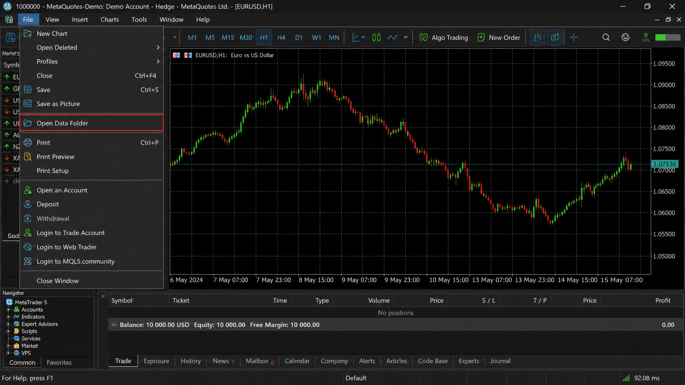
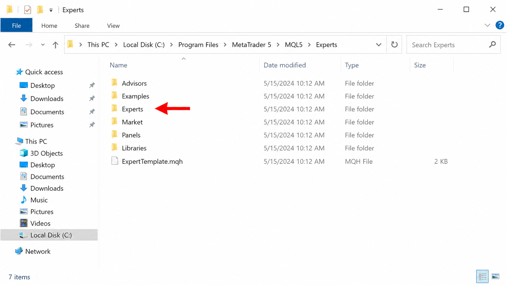
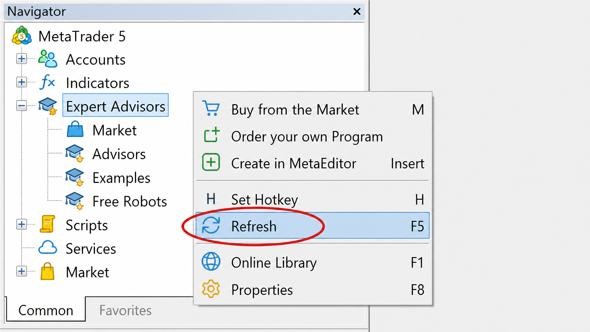
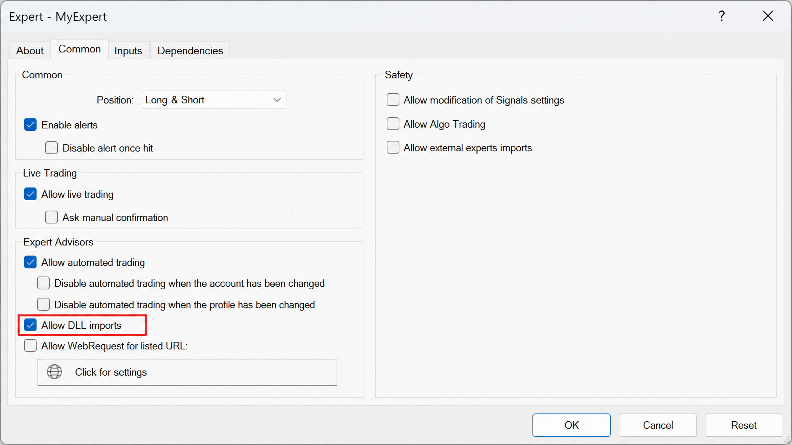

# Guía de Instalación: PriceExporter en MetaTrader 5

Esta guía explica cómo instalar y configurar el Expert Advisor (EA) `PriceExporter.mq5` para que el sistema **TradingSignal Pro** pueda recibir precios en tiempo real de forma offline.

---

### Paso 1: Abrir la Carpeta de Datos de MetaTrader 5
1. Abra su terminal de **MetaTrader 5**.
2. En el menú superior, haga clic en **Archivo (File)**.
3. Seleccione la opción **Abrir carpeta de datos (Open Data Folder)**.

---

### Paso 2: Copiar el archivo PriceExporter.mq5
1. En la ventana que se abrió, navegue a la carpeta: `MQL5` > `Experts`.
2. Copie el archivo `PriceExporter.mq5` (ubicado en la carpeta `scripts/` de su proyecto) y péguelo dentro de la carpeta `Experts`.

---

### Paso 3: Refrescar el Navegador en MT5
1. Regrese a MetaTrader 5.
2. Busque el panel **Navegador (Navigator)** (Ctrl+N).
3. Haga clic derecho sobre **Asesores Expertos (Expert Advisors)**.
4. Seleccione **Refrescar (Refresh)**. Ahora verá `PriceExporter` en la lista.

---

### Paso 4: Configurar y Activar el EA
1. Arrastre `PriceExporter` a **cualquier gráfico** (ej. EURUSD).
2. Se abrirá una ventana de configuración. Vaya a la pestaña **Común (Common)**.
3. **IMPORTANTE:** Asegúrese de marcar la casilla **Permitir importar DLL (Allow DLL imports)**.
4. Haga clic en **Aceptar**.

---

### Paso 5: Verificar la Exportación
1. Asegúrese de que el botón **Algo Trading** en la parte superior de MT5 esté en color **Verde**.
2. El sistema comenzará a generar el archivo `mt4_prices.csv` en la carpeta común de MetaQuotes automáticamente.
3. Inicie el sistema Python con `run_system.bat` y verá cómo los precios se actualizan cada segundo.

---
**Nota:** El archivo MQ5 está diseñado para funcionar nativamente en la arquitectura de 64 bits de MetaTrader 5.
